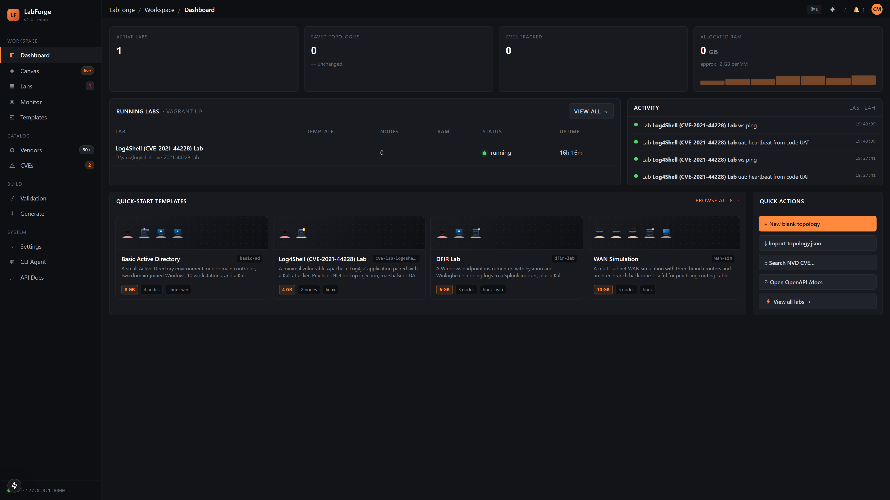
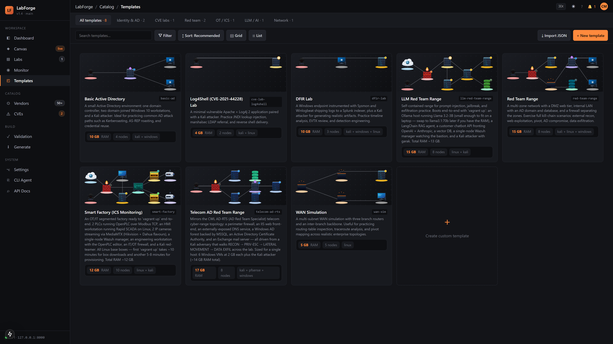
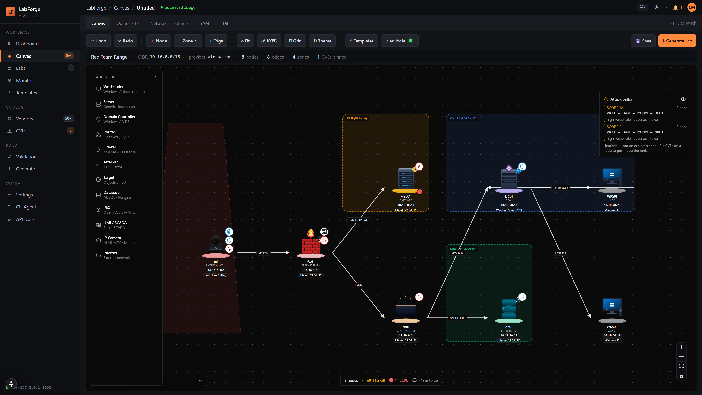
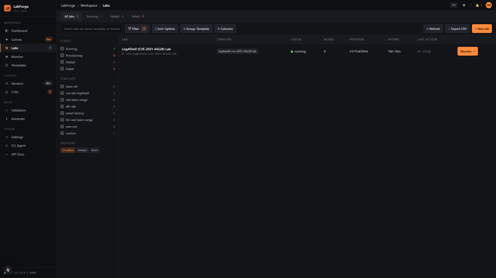
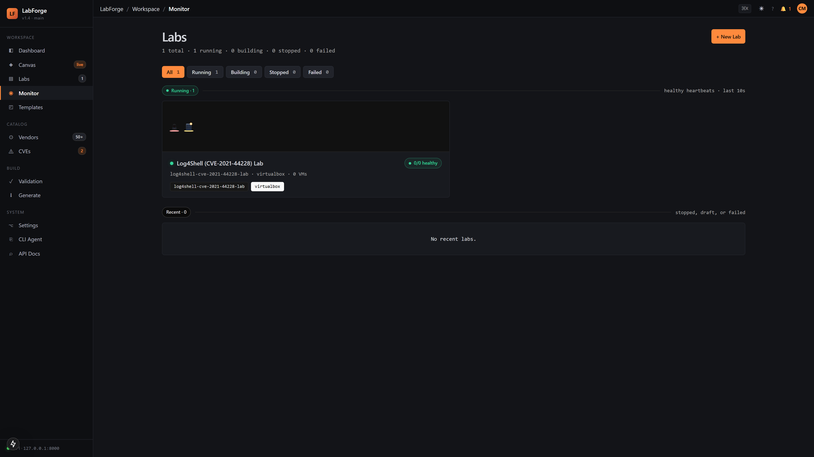

# LabForge

Diagram-driven virtual lab builder for cybersecurity professionals. Draw a
network on a canvas, attach roles (Splunk, Wazuh, Kali, OpenPLC…), click
**Generate Lab**, and `vagrant up` boots the whole thing locally.

---

## For penetration testers & security researchers

You've just discovered a CVE in the wild. Maybe you found it during a
penetration test, maybe it's trending on Twitter, maybe it's on your backlog.
Now what?

LabForge is for anyone who needs to:

- **Research & develop** a CVE or vulnerability in an isolated lab without
  disrupting production or needing physical infrastructure.
- **Prototype & validate** exploits in a realistic network topology (AD
  domains, segmented subnets, SIEM integration, ICS/HMI stacks, cloud
  simulation…) from your home or office.
- **Demo & communicate** attack paths and mitigations to stakeholders. Build
  a reproducible proof-of-concept lab, document the topology, and hand it off
  to your team or client.
- **Practice & learn** with pre-built labs (Log4Shell, AD compromises, DFIRs,
  supply-chain simulations) or design custom ones from scratch in minutes.

**The workflow is simple:** sketch a network on the canvas, attach vendors
and roles (Splunk for detection, Kali for attack, OpenPLC for ICS…), tag
nodes with CVEs for documentation, hit **Generate Lab**, and `vagrant up`
spins up everything locally. All topology is code—version it, share it,
fork it.

No cloud bills. No shared infrastructure. No waiting for provisioning. Just
click, generate, and explore.

---

## Screenshots

### Dashboard — Mission Control
Track active labs, resource usage, recent activity, and quick-launch templates
from one place.



### Template Gallery
8 pre-built lab topologies covering AD, CVE exploitation, DFIR, ICS/OT, LLM
red-teaming, and WAN simulation. Pick one and the canvas pre-populates.



### Canvas — Diagram-Driven Lab Builder
Drag nodes from the left palette, draw edges, pin CVEs to machines, and let
the attack-path heuristic score your topology automatically.



### Labs — Provisioned Lab Manager
See every lab that's been built, with live vagrant status, provider, uptime,
and a live log tail so you can watch `vagrant up` in real time.



### Monitor — Live Lab Telemetry
Per-lab heartbeat view showing VM health, network flows, and build-phase
progress as the lab provisions.



---

## Quick start (under 2 minutes)

Prerequisites: **Node 20+**, **pnpm 9+**, **Python 3.12+**, **uv** (Python package installer), **Vagrant 2.4+**,
**VirtualBox 7+** (or VMware / libvirt).

```bash
# 1. Install Node dependencies
pnpm install

# 2. Set up Python virtual environment and dependencies
pip install uv            # install uv if you don't have it
uv venv                   # create a virtual environment (.venv)
pnpm run setup            # installs API + agent Python deps via uv

# 3. Start both services
pnpm dev                  # → API on :8000, web on :3000
```

> No `concurrently`? Run `pnpm dev:api` and `pnpm dev:web` in two terminals.

Open <http://127.0.0.1:3000>, pick a template, hit **Generate Lab**.

### Or with Docker

```bash
docker compose up
```

Same two ports, no Python toolchain on your host.

---

## What's inside

| Path                 | What                                                              |
|----------------------|-------------------------------------------------------------------|
| `apps/web/`          | Next.js 15 canvas + dashboard                                     |
| `apps/api/`          | FastAPI backend (validate · NVD · Vagrantfile generator)          |
| `packages/schema/`   | Shared topology schema (Zod + Pydantic)                           |
| `packages/agent/`    | `labforge` CLI that drives `vagrant up`                           |

The CLI is optional — everything you can do from the web UI you can do
from the API.

---

## Bundled templates

Loaded from `packages/schema/templates/`:

- `basic-ad` — DC + workstations + Kali (~10 GB)
- `cve-lab-log4shell` — Apache + Log4j 2.14 + Kali (~6 GB)
- `red-team-range` — Full DMZ + AD (~15 GB)
- `dfir-lab` — Sysmon + Winlogbeat + Splunk (~14 GB)
- `wan-sim` — Multi-subnet routing (~7 GB)
- `smart-factory` — OpenPLC + HMI + cameras + Wazuh (~12 GB, all Linux)
- `llm-red-team-range` — Ollama + LangChain + garak (~15 GB, all Linux)

Each template is just a JSON file; drop your own next to them.

---

## API

All routes under `/api/v1/`. Live OpenAPI at <http://127.0.0.1:8000/docs>.

Common endpoints:

```
GET    /api/v1/templates
POST   /api/v1/topologies/validate
POST   /api/v1/generate            → zip with Vagrantfile + provisioners
GET    /api/v1/cves/search?q=…     → NVD search
GET    /api/v1/labs                → provisioned-lab state
POST   /api/v1/labs/build          → kick off `vagrant up` in background
```

---

## CLI

```bash
labforge templates pull basic-ad --output basic-ad.json
labforge run basic-ad.json
labforge status basic-ad
labforge destroy basic-ad
```

---

## Development

```bash
pnpm typecheck        # web + schema
pnpm --filter @labforge/web dev

# Backend
cd apps/api && uv run pytest
cd apps/api && uv run ruff check .
```

The Zod schema (`packages/schema/src/index.ts`) and Pydantic schema
(`packages/schema/python/labforge_schema/topology.py`) must stay in sync.

---

## License

For authorised security testing and education. Do not deploy the generated
vulnerable hosts to public networks.
