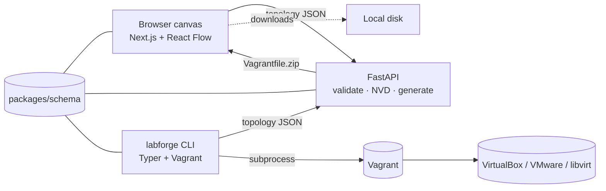

# LabForge

Diagram-driven virtual lab builder for cybersecurity professionals. Design
realistic network topologies on a canvas — full pictorial illustrations of
servers, workstations, firewalls, PLCs, IP cameras, attackers, etc. — group
them into zones (forests, clusters, DMZs), attach the security and AI tools
that should run on each host, then one-click generate a Vagrant + provisioner
bundle and bring the lab up locally with the `labforge` CLI.

> Drop your captured canvas image into `docs/canvas.png` and this README will
> pick it up.

## Why

Spinning up a realistic security lab takes hours of YAML, base-box pinning,
SCADA emulator install instructions, and PowerShell. LabForge collapses that
into:

1. Drag pictorial nodes onto a canvas (server rack, brick-wall firewall,
   hoodie attacker, isometric PLC, IP camera, …)
2. Group nodes inside **zone shapes** (rectangle / ellipse / triangle) — your
   forest, DMZ, OT segment, tenant
3. Pin CVEs from the NVD and stack vendor logos (Splunk, Wazuh, MDE,
   Siemens, Claude, Ollama, …) on each chassis — every vendor with a real
   version dropdown
4. Click **Generate Lab** → download a zip with `Vagrantfile`,
   `provision/*.sh`/`*.ps1`, `hosts`, `README.md`
5. `vagrant up` — or `labforge run topology.json`

## Architecture



The canonical topology schema lives in [`packages/schema`](packages/schema)
and is mirrored as Zod (TypeScript) and Pydantic v2 (Python).

## Canvas

### 11 pictorial node types

Every node is a hand-authored SVG illustration sitting on a colored plinth,
not a rectangular card. Click an illustration to open the config panel; drag
from the right edge to draw a connection.

| Illustration            | Type                  | Default OS                | Typical use                              |
|-------------------------|-----------------------|---------------------------|------------------------------------------|
| Monitor + tower         | `workstation`         | Windows 10                | End-user host                            |
| Isometric rack          | `server`              | Ubuntu 22.04 LTS          | Generic Linux/Windows server             |
| Rack + AD diamond       | `domain_controller`   | Windows Server 2019       | AD DS / DNS                              |
| Antenna router          | `router`              | OpenWrt 23.05             | Routing appliance                        |
| Brick wall + flame      | `firewall`            | pfSense 2.7 CE            | Perimeter / segment firewall             |
| Hooded laptop figure    | `attacker`            | Kali Linux Rolling        | Red-team origin                          |
| Rack + crosshair        | `target`              | Ubuntu 22.04 LTS          | Vulnerable / objective host              |
| Stacked disks           | `database`            | Ubuntu 22.04 LTS          | MySQL / Postgres / MSSQL / Mongo         |
| Industrial yellow brick | `ics_plc`             | Siemens SIMATIC           | PLC (S7, Modicon, ControlLogix…)         |
| Mimic-screen HMI        | `ics_hmi`             | Windows 10                | HMI / SCADA operator station             |
| Bullet IP camera        | `camera`              | IP Camera Firmware        | CCTV / surveillance                      |
| Cloud + globe           | `internet`            | n/a (not provisioned)     | External network / cloud placeholder     |

### Zones — forests, clusters, DMZs

Group nodes inside coloured background shapes. Three shapes available from
**Add zone** in the toolbar:

- **Rectangle** — subnets, on-prem segments
- **Ellipse** — AD forests, clusters
- **Triangle** — trust zones, DMZs, "internet" buckets

Zones are draggable, resizable, label-editable, and persisted with the
topology. They render behind all other nodes via React Flow's `zIndex`.

### Vendor sticker badges

Each node shows up to four "applied sticker" logo pills floating in its
top-right corner — derived from `node.config.roles`. Hover any badge to see
the vendor name; click the gear pip to open the config sheet. Anything in
the catalog (50+ entries below) renders with its brand color; custom roles
without a catalog entry still drive the provisioner, they just don't get a
logo.

### Light + dark mode

Toggle the theme from the toolbar. Edge connections now use
`hsl(var(--foreground)/0.65)` so they're equally visible in light mode.

## Vendor catalog (50+ entries with versions)

Picker accessed via the **Vendors** tab on each node. Categories:

| Category          | Entries                                                                                              |
|-------------------|------------------------------------------------------------------------------------------------------|
| **SIEM**          | Splunk · Elastic · Elastic Stack · Kibana · Logstash · Grafana · Prometheus · Microsoft Sentinel     |
| **EDR**           | Microsoft Defender for Endpoint · CrowdStrike Falcon · SentinelOne · Sophos Intercept X              |
| **Host Monitoring** | Sysmon · Winlogbeat · Wazuh · OSSEC · Falco                                                        |
| **IDS / NSM**     | Snort · Suricata · Zeek · Wireshark                                                                  |
| **ICS / SCADA**   | Siemens SIMATIC · Schneider Modicon · Rockwell Allen-Bradley · Mitsubishi MELSEC · OpenPLC · Rapid SCADA · snap7 · Ignition · Modbus TCP · OPC UA |
| **AI / ML**       | OpenAI · Anthropic Claude · Google Gemini · Ollama · Meta Llama · Hugging Face · LangChain · PyTorch · TensorFlow · scikit-learn · Keras · vLLM · Prompt-Injection eval |
| **Camera / IoT**  | MediaMTX · Motion · Frigate · Hikvision · Dahua · MQTT broker                                        |
| **Web Server**    | Apache · nginx                                                                                       |
| **Database**      | MySQL · PostgreSQL · MS SQL Server · MongoDB · Redis                                                 |
| **Container**     | Docker · Kubernetes · Podman · Trivy                                                                 |
| **DevOps**        | GitHub · GitLab · Jenkins · Ansible · Terraform                                                      |
| **Identity**      | Active Directory · Keycloak · Okta · Auth0 · HashiCorp Vault                                         |
| **Network**       | Cisco · pfSense · OPNsense · FRRouting                                                               |
| **Offensive**     | Kali · Parrot · Metasploit · Burp Suite · Impacket · BloodHound · HackTheBox · TryHackMe             |
| **Observability** | InfluxDB · ClickHouse · Neo4j · Cloudflare · Google Cloud                                            |
| **OS**            | Ubuntu · Debian · CentOS · Alpine · Windows                                                          |

Where Simple Icons doesn't carry a brand for trademark reasons (Microsoft,
CrowdStrike, Wazuh, Sysmon, the ICS firmware vendors), LabForge falls back
to a Lucide glyph tinted with the vendor's signature color.

Each entry can declare a `versions: string[]` — Splunk has 9.3 / 9.2 / 9.1 /
8.2.x, Wazuh has 4.9 / 4.8 / 4.7 / 4.6, Ollama has 0.4 / 0.3.14 / 0.3.0,
Llama has 3.3-70B / 3.2-11B / 3.1-405B / 3.1-70B, etc. Versions are saved
into the role string as `id@version` (e.g. `wazuh@4.9.0`) so the provisioner
sees them too.

## OS catalog (37 entries)

Surfaced in **General → Operating system** per node type:

- **Desktop:** Windows 10/11, macOS Sonoma, macOS Sequoia
- **Linux server:** Ubuntu 22.04/24.04, Debian 12, RHEL 9, CentOS Stream 9,
  Fedora 40, openSUSE Tumbleweed, Arch Linux, Alpine
- **BSD:** FreeBSD 14
- **Offensive / privacy:** Kali Rolling, Parrot Security, BlackArch, Tails 6,
  Whonix 17
- **Router / switch:** OpenWrt 23.05, VyOS 1.4, MikroTik RouterOS 7,
  Cisco IOS-XE, Juniper Junos 22
- **Firewall appliance:** pfSense 2.7 CE, OPNsense 24, FortiOS 7,
  PAN-OS 11, Sophos XG 19
- **Embedded / ICS:** VxWorks 7, Siemens SIMATIC, Schneider Modicon,
  QNX Neutrino, Raspberry Pi OS 12
- **Camera:** IP Camera Firmware (generic Linux + MediaMTX/motion fallback)

The Vagrantfile generator's `BOX_MAP` maps everything to a real Vagrant box
where one exists, and falls back to `ubuntu/jammy64` + a provisioner-driven
emulator (OpenPLC for PLCs, MediaMTX for cameras, FRR for routers,
iptables for firewalls) where there isn't a publicly available appliance
box. The generated README per-lab calls out which nodes need a manual image.

## Repo layout

```
labforge/
├── apps/
│   ├── web/                Next.js 15 + React 19 + @xyflow/react canvas
│   └── api/                FastAPI + SQLModel + Jinja2 + NVD client
├── packages/
│   ├── schema/             Zod + Pydantic shared schema (+ 5 templates)
│   └── agent/              Typer CLI that drives `vagrant up`
├── pnpm-workspace.yaml
└── README.md
```

## Prerequisites

| Tool          | Minimum |
|---------------|---------|
| Node.js       | 20.x    |
| pnpm          | 9.x     |
| Python        | 3.12    |
| [uv](https://docs.astral.sh/uv/) (recommended) or pip | latest |
| Vagrant       | 2.4 (only for `labforge run`)  |
| VirtualBox    | 7.x (or VMware / libvirt)      |

## First-time setup

```bash
# 1) Install JS deps (this also wires up @labforge/schema as a workspace package).
pnpm install

# 2) Install API deps.
cd apps/api
uv pip install -e .            # or: pip install -e .

# 3) Install CLI agent deps.
cd ../../packages/agent
uv pip install -e .            # or: pip install -e .

# 4) Initialise the agent config.
labforge init --provider virtualbox
```

## Running it

In two terminals from the repo root:

```bash
# Backend — http://127.0.0.1:8000  (OpenAPI at /docs)
pnpm dev:api

# Frontend — http://127.0.0.1:3000
pnpm dev:web
```

Open the canvas, click **Templates**, load `Basic Active Directory`, hit
**Generate Lab**. You get a zip with a `Vagrantfile`, `provision/`,
`hosts`, and a `README.md`. Then:

```bash
unzip labforge-basic-ad.zip -d ~/labs/basic-ad
cd ~/labs/basic-ad
vagrant up
```

Or skip the unzip dance:

```bash
labforge templates pull basic-ad --output basic-ad.json
labforge run basic-ad.json
labforge status basic-ad
labforge destroy basic-ad
```

## API surface

All routes are versioned under `/api/v1/`. Full OpenAPI lives at `/docs`.

| Method | Path                            | Purpose                                  |
|--------|---------------------------------|------------------------------------------|
| GET    | `/templates`                    | List prebuilt templates                  |
| GET    | `/templates/{id}`               | Fetch a full topology (including zones)  |
| POST   | `/topologies/validate`          | Cross-field validation (IPs, hostnames…) |
| POST   | `/topologies`                   | Upsert a saved topology                  |
| GET    | `/topologies/{slug}`            | Fetch a saved topology                   |
| POST   | `/generate`                     | Returns a zip of Vagrantfile + scripts   |
| GET    | `/cves/search?q=...`            | NVD CVE search                           |
| GET    | `/cves/{cve_id}`                | Lookup a single CVE                      |
| GET    | `/cves/curated`                 | CVEs we ship curated provisioners for    |
| GET    | `/labs`                         | List provisioned-lab records             |

Errors are uniform: `{ "detail": "...", "code": "..." }`.

## Bundled templates

Every template ships ready to **`vagrant up`** without manual editing — the
generator emits real install commands (Wazuh, OpenPLC, MediaMTX, Ollama,
Splunk Forwarder, …), uses only [Vagrant Cloud](https://app.vagrantup.com/)
boxes that exist publicly, and sizes RAM so the whole lab fits on a 16 GB
host. First run downloads 1–2 base boxes (~5 GB cached after that) and
converges in 10–15 minutes total.

Stored as JSON in [`packages/schema/templates/`](packages/schema/templates).
Each conforms to the canonical `LabConfig` schema (now with optional
`zones: Zone[]`), so adding your own is just a JSON file in that folder.

| ID                       | RAM     | Scenario                                                                          |
|--------------------------|---------|-----------------------------------------------------------------------------------|
| `basic-ad`               | ~10 GB  | 1 DC + 2 workstations + Kali (Kerberoasting / AS-REP)                             |
| `cve-lab-log4shell`      | ~6 GB   | Vulnerable Apache + Log4j 2.14 with a JNDI callback path                          |
| `red-team-range`         | ~15 GB  | Full DMZ + AD + DB + firewall (8 nodes)                                           |
| `dfir-lab`               | ~14 GB  | Sysmon + Winlogbeat + Splunk + adversary emulator                                 |
| `wan-sim`                | ~7 GB   | Multi-subnet OSPF routing lab                                                     |
| `smart-factory`          | ~12 GB  | OT/IT segmented factory: 2 PLCs (OpenPLC + Modbus TCP), HMI running Rapid SCADA, 2 IP cameras (MediaMTX + Hikvision/Dahua flavours), single-node Wazuh manager, IT/OT firewall, Kali attacker. **All Linux — `vagrant up` works end-to-end.** |
| `llm-red-team-range`     | ~15 GB  | Local LLM range: Ollama hosting Llama 3.2-3B (swap to 70B if you have the RAM), LangChain RAG agent, customer chatbot fronting OpenAI + Anthropic SDKs, MongoDB vector DB, Wazuh manager, Kali with garak prompt-injection toolkit. **All Linux — `vagrant up` works end-to-end.** |

### What actually happens on `vagrant up`

1. **Box download** — Each unique base box pulls from Vagrant Cloud:
   `ubuntu/jammy64` (~600 MB), `kalilinux/rolling` (~3 GB), plus the
   Windows eval boxes for `basic-ad` (~7–9 GB each).
2. **Boot** — Each VM boots and gets its `private_network` IP from the
   topology.
3. **Provisioning** — The per-node shell or PowerShell script runs as root.
   Real installers fire (apt + curl + git clone). Logs land in
   `/var/log/labforge-provision.log` (Linux) or
   `C:\Labforge\provision.log` (Windows).
4. **You're done** — `vagrant ssh <hostname>` into anything; the services
   in the role list are running.

### Role installers shipped today

The generator strips `@version` suffixes and dispatches each role to a
curated installer in
[`apps/api/labforge_core/provisioners/role_installers.py`](apps/api/labforge_core/provisioners/role_installers.py).
Currently bundled:

**Linux** — wazuh, wazuh-manager, splunk (UF), elastic, kibana, grafana,
prometheus, apache, nginx, mysql, postgresql, mongodb, redis, docker,
snort, suricata, zeek, wireshark, samba, openplc, rapidscada, modbus-tcp,
mqtt, mediamtx, motion, ollama, langchain, huggingface, pytorch, openai,
anthropic, ai-jailbreak-detector (garak), vllm, metasploit, impacket,
bloodhound, crackmapexec / netexec, nmap, iptables, frr, openwrt-emulator,
pfsense-emulator, opnsense-emulator, keycloak, vault, DNS (bind9).

**Windows** — sysmon (+ SwiftOnSecurity config), winlogbeat,
powershell-transcripts, splunk (UF), wazuh agent, rapidscada,
modbus-master, rdp (enables Remote Desktop), AD-Domain-Services (full
first-forest promotion).

Anything not on this list still drives the provisioner (you'll see a
comment block where the install would go) — drop a snippet into
`role_installers.py` to wire up your own.

## CVE provisioner mapping

Known CVEs (curated shell scripts in
[`apps/api/labforge_core/provisioners/scripts/`](apps/api/labforge_core/provisioners/scripts/))
are inlined into the per-node provisioner. Unknown CVEs emit a labelled stub
with a link to the NVD entry so you can drop in the exploit chain yourself.

Currently bundled curated CVEs:

| CVE              | Stack                                  |
|------------------|----------------------------------------|
| CVE-2021-44228   | Apache Log4j 2.14 (Log4Shell)          |
| CVE-2017-5638    | Apache Struts 2 multipart parser RCE   |

PRs welcome — drop a `cve-XXXX-NNNNN.sh` in the scripts folder and add an
entry to `cve_lookup.py`'s description map.

## Development notes

- The Zod schema in `packages/schema/src/index.ts` and the Pydantic schema in
  `packages/schema/python/labforge_schema/topology.py` must stay in sync.
  The field set, enums, regex constraints, and defaults all match.
- The web app proxies `/api/v1/*` to `http://127.0.0.1:8000` via
  `next.config.ts`. Override with `LABFORGE_API_URL` if your backend runs
  elsewhere.
- The canvas store (`apps/web/lib/store/topology-store.ts`) holds both
  `FlowNode`s (real hosts) and `FlowZone`s (background shapes) in a single
  React Flow nodes array, plus a 100-entry undo/redo history.
- Validation runs both client-trip (Zod via the shared package) and
  server-side via `services/validator.py`. The server check is authoritative
  — hostname uniqueness, IP-in-CIDR, DC must run Windows Server, ICS PLC
  must run a supported ICS/Linux OS, attacker must run a supported pentest
  distro, etc.
- The Vagrantfile template
  (`apps/api/labforge_core/templates/Vagrantfile.j2`) pins per-OS base
  boxes; tweak the `BOX_MAP` in `services/generator.py` if your estate uses
  different ones.

## Useful commands

```bash
pnpm typecheck       # Type-check the web app
pnpm lint            # Next.js lint
pnpm --filter @labforge/schema typecheck

# From apps/api:
ruff check .
pytest               # (tests are scaffolded; add yours next to the modules)
```

## License

This project is intended for authorised security testing and education. Do
not deploy the generated vulnerable hosts or ICS / camera emulators to
public networks.
